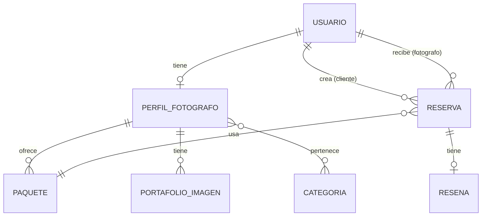

# 📊 Base de Datos MySQL - Proyecto Fotografía

## 🎯 Arquitectura de Base de Datos

Este proyecto usa **MySQL** como base de datos principal con **Prisma ORM** para el acceso a datos.

### Entidades del Sistema

```
┌─────────────┐       ┌──────────────────┐       ┌─────────────┐
│   Usuario   │──1:1──│ PerfilFotografo │──1:N──│  Paquete    │
└─────────────┘       └──────────────────┘       └─────────────┘
       │                       │                         │
       │                       │                         │
       │                  ┌────┴────┐                    │
       │                  │         │                    │
       │             ┌────▼────┐    │              ┌─────▼─────┐
       │             │Fotografo│    │              │  Reserva  │
       │             │Categoria│    │              └───────────┘
       │             └─────────┘    │                    │
       │                  │         │                    │
       │             ┌────▼────┐    │              ┌─────▼─────┐
       │             │Categoria│◄───┘              │  Reseña   │
       │             └─────────┘                   └───────────┘
       │
  ┌────▼────────┐
  │PortafolioImg│
  └─────────────┘
```

## 📋 Entidades Detalladas

### 1. **Usuario** (`usuarios`)
Tabla principal de usuarios del sistema.

| Campo | Tipo | Descripción |
|-------|------|-------------|
| `id` | INT (PK) | ID autoincremental |
| `nombre` | VARCHAR(100) | Nombre corto/usuario |
| `nombre_completo` | VARCHAR(255) | Nombre completo |
| `email` | VARCHAR(255) UNIQUE | Email del usuario |
| `password_hash` | VARCHAR(255) | Contraseña hasheada |
| `password_salt` | VARCHAR(255) | Salt (compatibilidad Apps Script) |
| `rol` | ENUM | CLIENTE, FOTOGRAFO, ADMIN |
| `telefono` | VARCHAR(20) | Teléfono de contacto |
| `activo` | BOOLEAN | Si el usuario está activo |
| `email_verificado` | BOOLEAN | Si verificó su email |
| `created_at` | DATETIME | Fecha de creación |
| `updated_at` | DATETIME | Fecha de actualización |

**Relaciones:**
- 1:1 con `PerfilFotografo` (si es fotógrafo)
- 1:N con `Reserva` (como cliente)
- 1:N con `Reserva` (como fotógrafo)

---

### 2. **PerfilFotografo** (`perfiles_fotografos`)
Información extendida de fotógrafos.

| Campo | Tipo | Descripción |
|-------|------|-------------|
| `id` | INT (PK) | ID autoincremental |
| `usuario_id` | INT (FK UNIQUE) | Referencia a Usuario |
| `nombre_publico` | VARCHAR(255) | Nombre que aparece públicamente |
| `biografia` | TEXT | Biografía del fotógrafo |
| `ubicacion` | VARCHAR(255) | Ciudad/ubicación |
| `sitio_web` | VARCHAR(500) | Sitio web personal |
| `url_foto_perfil` | VARCHAR(500) | URL de foto de perfil |
| `url_foto_portada` | VARCHAR(500) | URL de foto de portada |
| `portfolio` | TEXT | JSON array de URLs |
| `calificacion_promedio` | DECIMAL(3,2) | Calificación promedio |
| `total_resenas` | INT | Total de reseñas |
| `verificado` | BOOLEAN | Si está verificado |
| `created_at` | DATETIME | Fecha de creación |
| `updated_at` | DATETIME | Fecha de actualización |

**Relaciones:**
- N:M con `Categoria` (mediante `FotografoCategoria`)
- 1:N con `Paquete`
- 1:N con `PortafolioImagen`

---

### 3. **Categoria** (`categorias`)
Categorías de servicios fotográficos.

| Campo | Tipo | Descripción |
|-------|------|-------------|
| `id` | INT (PK) | ID autoincremental |
| `nombre` | VARCHAR(100) UNIQUE | Nombre de la categoría |
| `tipo` | VARCHAR(100) | Tipo (Evento, Estilo, etc.) |
| `descripcion` | TEXT | Descripción |
| `icono` | VARCHAR(50) | Nombre del ícono |
| `activo` | BOOLEAN | Si está activa |
| `orden` | INT | Orden de aparición |
| `created_at` | DATETIME | Fecha de creación |
| `updated_at` | DATETIME | Fecha de actualización |

**Ejemplos:**
- Bodas (Tipo de Evento)
- Eventos Corporativos (Tipo de Evento)
- Documental (Estilo Fotográfico)
- Retrato (Género)

---

### 4. **FotografoCategoria** (`fotografo_categorias`)
Tabla pivot: Relación muchos a muchos entre fotógrafos y categorías.

| Campo | Tipo | Descripción |
|-------|------|-------------|
| `id` | INT (PK) | ID autoincremental |
| `fotografo_id` | INT (FK) | Referencia a PerfilFotografo |
| `categoria_id` | INT (FK) | Referencia a Categoria |
| `created_at` | DATETIME | Fecha de creación |

**Unique:** `[fotografo_id, categoria_id]`

---

### 5. **Paquete** (`paquetes_servicios`)
Paquetes de servicios que ofrece cada fotógrafo.

| Campo | Tipo | Descripción |
|-------|------|-------------|
| `id` | INT (PK) | ID autoincremental |
| `fotografo_id` | INT (FK) | Referencia a PerfilFotografo |
| `titulo` | VARCHAR(255) | Título del paquete |
| `descripcion` | TEXT | Descripción detallada |
| `precio` | DECIMAL(10,2) | Precio del paquete |
| `moneda` | ENUM | BOB, USD |
| `duracion_horas` | VARCHAR(50) | Duración (ej: "4 horas") |
| `incluye` | TEXT | Lista de lo que incluye |
| `imagen_url` | VARCHAR(500) | URL de imagen |
| `activo` | BOOLEAN | Si está activo |
| `destacado` | BOOLEAN | Si aparece destacado |
| `created_at` | DATETIME | Fecha de creación |
| `updated_at` | DATETIME | Fecha de actualización |

---

### 6. **PortafolioImagen** (`portafolio_imagenes`)
Imágenes del portafolio de cada fotógrafo.

| Campo | Tipo | Descripción |
|-------|------|-------------|
| `id` | INT (PK) | ID autoincremental |
| `fotografo_id` | INT (FK) | Referencia a PerfilFotografo |
| `url_imagen` | VARCHAR(500) | URL de la imagen |
| `descripcion` | VARCHAR(500) | Descripción/título |
| `orden` | INT | Orden de aparición |
| `destacada` | BOOLEAN | Si es destacada |
| `created_at` | DATETIME | Fecha de creación |
| `updated_at` | DATETIME | Fecha de actualización |

---

### 7. **Reserva** (`reservas`)
Reservas de servicios fotográficos.

| Campo | Tipo | Descripción |
|-------|------|-------------|
| `id` | INT (PK) | ID autoincremental |
| `cliente_id` | INT (FK) | Referencia a Usuario (cliente) |
| `fotografo_id` | INT (FK) | Referencia a Usuario (fotógrafo) |
| `paquete_id` | INT (FK) | Referencia a Paquete (opcional) |
| `fecha_evento` | DATE | Fecha del evento |
| `hora_evento` | VARCHAR(20) | Hora del evento |
| `ubicacion_evento` | VARCHAR(500) | Ubicación del evento |
| `estado` | ENUM | PENDIENTE, CONFIRMADA, CANCELADA, COMPLETADA, RECHAZADA |
| `monto` | DECIMAL(10,2) | Monto total |
| `moneda` | ENUM | BOB, USD |
| `notas` | TEXT | Notas adicionales |
| `created_at` | DATETIME | Fecha de creación |
| `updated_at` | DATETIME | Fecha de actualización |

**Relaciones:**
- 1:1 con `Resena`

---

### 8. **Resena** (`resenas`)
Reseñas y calificaciones de servicios.

| Campo | Tipo | Descripción |
|-------|------|-------------|
| `id` | INT (PK) | ID autoincremental |
| `reserva_id` | INT (FK UNIQUE) | Referencia a Reserva |
| `calificacion` | TINYINT | 1-5 estrellas |
| `comentario` | TEXT | Comentario del cliente |
| `publicado_por` | VARCHAR(255) | Nombre del cliente |
| `respuesta` | TEXT | Respuesta del fotógrafo |
| `visible` | BOOLEAN | Si es visible públicamente |
| `created_at` | DATETIME | Fecha de creación |
| `updated_at` | DATETIME | Fecha de actualización |

---

## 🔐 Índices de Base de Datos

Para optimizar las consultas, se crearon los siguientes índices:

### Tabla `usuarios`
- `email` (único)
- `rol`

### Tabla `perfiles_fotografos`
- `usuario_id` (único)
- `ubicacion`

### Tabla `categorias`
- `nombre` (único)
- `tipo`

### Tabla `fotografo_categorias`
- `fotografo_id`
- `categoria_id`
- Constraint único: `[fotografo_id, categoria_id]`

### Tabla `paquetes_servicios`
- `fotografo_id`
- `activo`

### Tabla `portafolio_imagenes`
- `fotografo_id`
- `destacada`

### Tabla `reservas`
- `cliente_id`
- `fotografo_id`
- `paquete_id`
- `estado`
- `fecha_evento`

### Tabla `resenas`
- `reserva_id` (único)
- `calificacion`
- `visible`

---

## 🚀 Comandos Prisma

### Inicializar Prisma
```bash
npx prisma init
```

### Generar el cliente de Prisma
```bash
npx prisma generate
```

### Crear migración
```bash
npx prisma migrate dev --name init
```

### Aplicar migraciones
```bash
npx prisma migrate deploy
```

### Abrir Prisma Studio (GUI)
```bash
npx prisma studio
```

### Reset de base de datos (⚠️ CUIDADO: Borra todos los datos)
```bash
npx prisma migrate reset
```

### Seed de datos (crear datos de prueba)
```bash
npx prisma db seed
```

---

## 📝 Ejemplo de Uso

```typescript
import { PrismaClient } from '@prisma/client'

const prisma = new PrismaClient()

// Crear un usuario fotógrafo
const fotografo = await prisma.usuario.create({
  data: {
    nombreCompleto: 'Juan Pérez',
    email: 'juan@example.com',
    passwordHash: hashedPassword,
    rol: 'FOTOGRAFO',
    telefono: '+59171234567',
    perfilFotografo: {
      create: {
        biografia: 'Fotógrafo especializado en bodas',
        ubicacion: 'Sucre',
        nombrePublico: 'Juan Fotografía'
      }
    }
  },
  include: {
    perfilFotografo: true
  }
})

// Obtener todos los fotógrafos con sus paquetes
const fotografos = await prisma.perfilFotografo.findMany({
  include: {
    usuario: true,
    paquetes: true,
    categorias: {
      include: {
        categoria: true
      }
    }
  }
})
```

---

## 🔄 Migración desde Google Sheets

Para migrar datos desde Google Apps Script a MySQL, crear un script de migración que:

1. Lee datos de Google Sheets
2. Transforma el formato si es necesario
3. Inserta en MySQL usando Prisma

Ejemplo:
```typescript
// migration/migrate-from-sheets.ts
import { PrismaClient } from '@prisma/client'
import { getSheetData } from './google-sheets-service'

const prisma = new PrismaClient()

async function migrateUsers() {
  const sheetUsers = await getSheetData('Usuarios')
  
  for (const user of sheetUsers) {
    await prisma.usuario.create({
      data: {
        nombreCompleto: user.nombre_completo,
        email: user.email,
        passwordHash: user.password_hash,
        rol: user.rol.toUpperCase(),
        telefono: user.telefono
      }
    })
  }
}
```

---

## 📊 Diagrama ER



---

## 🛠️ Mantenimiento

### Backup
```bash
mysqldump -u foto_user -p fotografia_db > backup_$(date +%Y%m%d).sql
```

### Restore
```bash
mysql -u foto_user -p fotografia_db < backup_20251113.sql
```

---

**Fecha:** Noviembre 2025  
**Proyecto:** SIS324 - Ingeniería de Software  
**Grupo:** 16
